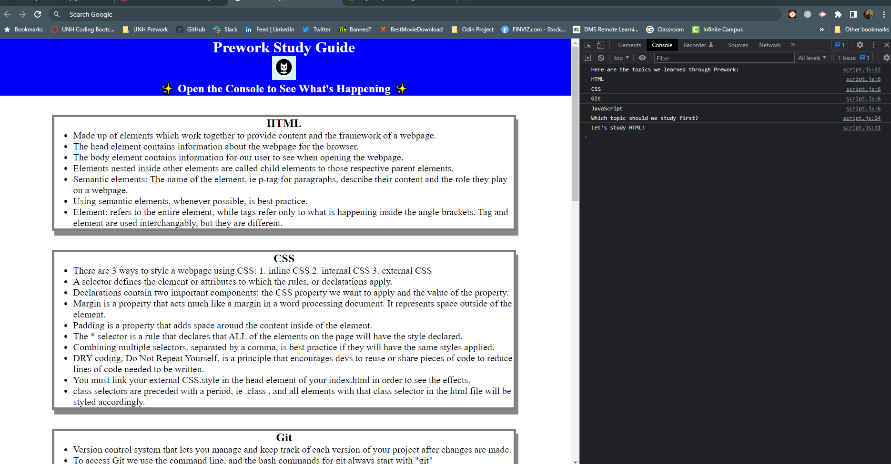

# Prework Study Guide Webpage

## Description

The goal of creating this webpage was to keep an organized record of my learning journey throughout the prework learning modules.
I built this project to keep all of my notes in an organized place and familiarize myself with HTML, CSS, Git, and Javascript.
While creating the Prework study guide webpage, I learned the basics of HTML, CSS, Git, and Javascript. 
In addition, I learned how to navigate through Github and use my local machine to push things to Github through Git. It gave me some hands on experience.

## Installation

What are the steps required to install your project? Provide a step-by-step description of how to get the development environment running.

## Usage

To use the Prework Study Guide webpage, you can scroll to any of the following sections to review the notes I took conscerning each topic: HTML, CSS, Git, and JavaScript.
Further, to see the JavaScript running, you can open the DevTools console.

To add a screenshot, create an `assets/images` folder in your repository and upload your screenshot to it. Then, using the relative file path, add it to your README using the following syntax:

## Credits

N/A

## License

Please refer to the LICENSE in the Repo.

